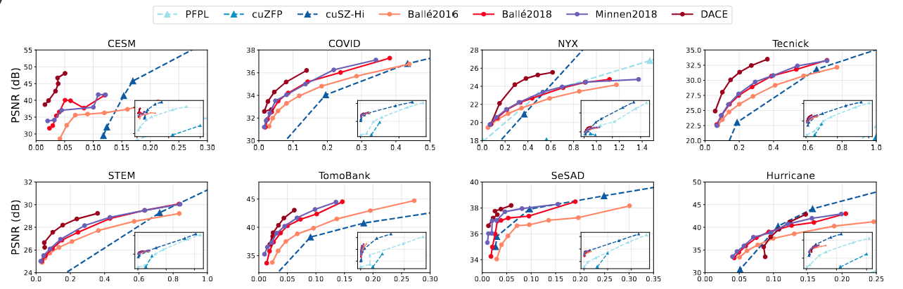

# CAIEC

**CAIEC: End-to-End Performance Optimization for AI-Based Scientific Data Compression via Inference-Encoding Co-Design**

This repository contains the reference implementation of **CAIEC**, a high-performance AI-based scientific data compression framework that co-designs **model inference** and **entropy encoding** to achieve **state-of-the-art end-to-end throughput** while preserving strong **rate–distortion (RD)** performance.

CAIEC significantly accelerates learned scientific data compression, achieving throughput comparable to leading non-AI GPU compressors, while consistently outperforming them in compression quality.

---

## 📄 Paper

If you use this code, please cite our paper:

> **CAIEC: End-to-End Performance Optimization for AI-Based Scientific Data Compression via Inference-Encoding Co-Design**
> Wenjing Huang, Yuhan Chen, Bing Lu, Zedong Liu, Hansheng Wang, Yida Gu, Zhuoru Zhang, Zheng Wei, Shiyuan Fu, Jinyang Liu, Guangming Tan, Dingwen Tao
> *Proceedings of VLDB 2026* (to appear)

*(ArXiv link will be added once available.)*

---

## 🚀 Key Features

CAIEC introduces **system-level optimizations** across the entire learned compression pipeline:

### 1. Scientific Data Preprocessing & Reconstruction

* Slice-wise normalization for heterogeneous scientific fields
* Three-channel stacking to reuse mature 2D learned image compression models
* Block-wise resolution control for memory-efficient GPU inference
* Overlapped tiling with weighted overlap-add (OLA) reconstruction to suppress block artifacts

### 2. Component-Level Mixed-Precision Inference

* Fine-grained FP8 / FP16 assignment based on **component RD sensitivity**
* Preserves compression quality while significantly improving inference throughput
* Achieves up to **6× inference speedup** over FP32 baselines

### 3. P-Controlled GPU Entropy Coding

* Fully GPU-based rANS entropy encoder
* Adjustable parallel granularity to balance **throughput vs. compression ratio**
* Avoids CPU–GPU synchronization overhead

---

## 📊 Performance Highlights

Evaluated on **8 real-world scientific datasets** (CESM, NYX, Hurricane, COVID, etc.) using NVIDIA H100 GPUs:

* **Compression throughput:** up to **14.48 GB/s**, average **10.14 GB/s**
* **Decompression throughput:** up to **7.43 GB/s**, average **5.77 GB/s**
* **Speedup over vanilla CompressAI:** up to **93.6× (compression)** and **66.9× (decompression)**
* Compression quality consistently outperforms state-of-the-art non-AI GPU compressors (cuSZ-Hi, cuZFP, PFPL)

---

## 🧱 Framework Overview

CAIEC follows an end-to-end learned compression pipeline:

```
Scientific Data
      ↓
Preprocessing (Normalization, Stacking, Tiling)
      ↓
Encoder (Mixed Precision)
      ↓
Quantization
      ↓
GPU Entropy Coding (P-controlled rANS)
      ↓
Compressed Bitstream
```

The decompression pipeline mirrors the process with GPU-based entropy decoding and weighted reconstruction.

---

## 🔧 Dependencies

* Python ≥ 3.9
* PyTorch ≥ 2.0
* CUDA ≥ 12.0
* NVIDIA GPU with Tensor Cores (Ampere or newer recommended)
* CompressAI (modified)
* TensorRT (optional, for deployment)

Detailed installation instructions will be provided soon.

---

## 🧪 Supported Datasets

CAIEC has been evaluated on a wide range of scientific domains:

* Climate simulation (CESM)
* Cosmology simulation (NYX)
* Weather simulation (Hurricane)
* Medical imaging (COVID X-ray)
* Microscopy (STEM)
* Crystallography (SeSAD)
* X-ray tomography (Tomobank)
* Photography (Tecnick)

---

## 📈 Performance Comparison

### 📊 End-to-End Throughput

The following figures compare **end-to-end compression and decompression throughput** of CAIEC with representative AI-based and non-AI GPU compressors across multiple real-world scientific datasets.

<p align="center">
  
</p>

<p align="center">
  <b></b> End-to-end compression and decompression throughput (GB/s) and speedup. Speedup is computed relative to the corresponding CompressAI implementation (denoted as Ori; Ball\'e2016 as B; DCAE as D). CAIEC(B) and AIZ(B) are normalized to Ori(B), while CAIEC(D) is normalized to Ori(D). Our method is highlighted in blue, and the best speedup in each row is marked in orange.
</p>

**Key observations:**

* CAIEC achieves **10–20 GB/s compression throughput**, reaching the same order of magnitude as state-of-the-art non-AI GPU compressors.
* Compared with vanilla CompressAI, CAIEC delivers up to **93.6× compression speedup** and **66.9× decompression speedup**.

---

### 📉 Rate–Distortion (RD) Performance

We compare CAIEC against representative **non-AI GPU compressors** and **existing AI-based approaches** in terms of **PSNR vs. bitrate (bpp)**.

<p align="center">
  
</p>

<p align="center">
  <b></b> Rate--distortion (RD) plots showing PSNR versus bitrate across eight representative datasets. The main panel in each subfigure zooms into the low-bitrate region, while the inset (bottom-right) shows the complete RD curves of all methods over the full bitrate range.
</p>

**Key observations:**

* CAIEC consistently achieves **higher PSNR at the same bitrate** compared to non-AI compressors (cuSZ-Hi, cuZFP, PFPL).
* At low bitrates, CAIEC preserves global structures and fine details more effectively.
* Mixed-precision inference introduces only **minor RD degradation**, while enabling substantial throughput gains.

---

### ⚖️ Throughput–Compression Ratio Trade-off

CAIEC exposes a tunable parameter **P** to control the parallel granularity of GPU entropy coding, enabling explicit trade-offs between throughput and compression efficiency.

<p align="center">
  
</p>

<p align="center">
  <b></b> Throughput--efficiency trade-off under different $P_{\mathrm{ch}}$ settings.
</p>

**Key observations:**

* Smaller *P* improves throughput via higher parallelism, with modest compression-ratio loss.
* Larger *P* improves compression efficiency while maintaining sufficient throughput.
* CAIEC selects *P* such that entropy coding does not become the end-to-end bottleneck.
---

## 📌 Status

🚧 **This repository is under active development.**

* [ ] Clean code release
* [ ] Installation scripts
* [ ] Reproducible evaluation pipeline
* [ ] Pretrained models
* [ ] Documentation & examples

Please stay tuned for updates.

---

## 🙏 Acknowledgements

This work builds upon:

* [CompressAI](https://github.com/InterDigitalInc/CompressAI)
* Prior work on GPU scientific compression (cuSZ, cuZFP, PFPL)
* NVIDIA CUDA and TensorRT ecosystem

---

